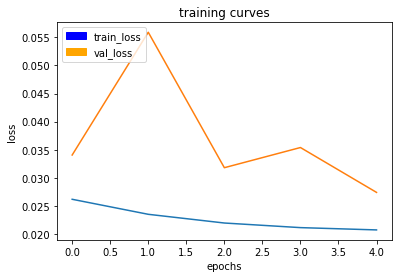

# RoboND-DeepLearning-Project
Project 4 for Udacity Nanodegree Program

## Introduction
The fourth and final project in the Udacity term 1 Nanodegree program is built around a hypothetical scenario in which an individual (called the 'hero' in the documentation)  is to be tracked by a drone. Some of the constraints / complications that accompany this problem are as follows:
 
 - The drone is tracking the person passively (i.e. there is no transmitter or other device to help the drone locate the person)
 - The drone only has a gimbled color 2D camera as a sensor for tracking
 - The hero is not alone, but is mixed in with other people
 - The environment is populated with other non-people objects such as trees, buildings and textured surfaces
 - There is no existing model for the hero, the implemented solution must be able to create one from known 'hero positive' images 

To solve this problem, the solution presented will be to build a fully convolutional network (FCN) to locate the hero in the images aquired by the camera. One advantage that FCN's have that this type of classifier will not only be able to predict (or infer) the presence of the hero, but also identify where the hero is in the image.

## Requirements
 1. Writeup / Readme: This document
    - Approach / Architecture
    - Parameters Used
    - Results
    - Future Enhancements
 2. Model Training Notebook: [model_training.ipynb](model_training.ipynb)
 3. Trained model weights: [model_weights.h5](model_weights.h5)
 4. Model accuracy must be greater than or equal to 40%
 
 
## Approach / Architecture
The approach taken was to start with the basic architecture shown in Section 32 for the lab decoder. As covered in that section, a Fully Convolutional Network consists of two major sections: the encoder and the decoder. By including within the encoder a 1x1 convolution layer and connecting it to the decoder, we can preserve the spatial information that is needed for our application (following the hero). A reproduction of that design (which was used for this submission) is shown below.

Each convolution layer sweeps its filter(or kernel) across the input by one 'step-size' at a time to extract n-features from the image based on the n-filters specified. The translational invariance of the conlvolution network also ensures that the hero can be identifed anywhere in the source image. The output of each convolution layer that is contains stack of all the activated filters. By applying  filters *separately* to each channel of the input, separable convolution layers reduce the number of parameters required. Spatial pooling is also iplemented to reduce the layer size as the depth increases and make the model scale independent (e.g the hero should be identified whether she is close to, or far away from the drone). 
In the decoder section the feature set is upsampled back to the original image size such that we have an output image that pixel for pixel maps the predictions from the FCN. Because the pooling / upsampling done by the FCN is spatialy lossy, skip connections are also incorporated into this model so that spatial resolution of the features identified in the final output is recovered. 

## Parameters Used
Once the architecture was finalized, the following model hyperparameters were configured prior to training the model on the AWS instance used for this project.

### Learning Rate
The learning rate determines how fast the the error gradeient descent converges to minimize the error. Learning rates that are too low can falsely converge on local minima or be too computationally intensive. The learning curve below shows a training run with a learning rate of 0.0001. While it does appear to be converging after 10 epochs, this run did not provide a IOU score that was passable. I do believe it would have utlimately been successful if the epochs was increased to 20, but would have taken several hours to train at these settings even on the AWS instance.

 .
 
 In following runs, the learning rate was decreased, but contrary to intuition, increasing the learning rate did not have a significant impact on the time to run each epoch. It did however result in training converging faster with fewer epochs. Below is a training cure wiht the learning rate set to 0.01.
 
 
 
 ### Batch Size
 Batch size determines the number of samples that propogate through the network in a single pass and was varied from 64 to 128 and attempted at 256 as well. The batch size made negligable difference in performance between 64 and 128, but crashed the script due to an out of resource error when set at 256.
 
 ### Epochs
 The epochs determines the number of times the entire training set is passed through the network. In the course experimenting with the number of epochs, it was found that counter-intuitively, more epochs do do not always result in better IOU results. For example, with identical settings, only varying the epoch from 5 to 4, the IOU score increased from .59 to .61 It is possible this is due to either the training model beginning to over-fit for the given parameters, or oscilation prior to convergence.
 
 ### Steps per Epoch
 Steps per epoch represents the number of images in the training dataset that go the network in each epoch. Based on the recomendation provided, of dividing the image count by the batch size a starting point would be 32. This resulted in a model with a score of 0. As a result, the steps was set to 200, 150 then 100 with 150 providing a good balance between computational time and model score.
 
 ### Validation Steps
 The validation steps is used to determine how many validation images go through the network per epoch. This was left at the provided value of 50. However, in general it is desirable to have as many validations images as possible go through the network (all if possible) per epoch as different validation sets will necessarily lead to slightly differnt results based on the images selected from the set.
 
 ### Workers
 The worker parameter determines the number of sub-processes to spin up. Since all of the training was done on the AWS instance, this was left at it's default value.
 
 ## Results
  A total of 8 training runs were executed on the AWS instance using the provided test data sat 
 
  Increasing the number of filters (depth) will increase the models ability to detect features, but will come at the cost of slowing the model training. Run 6 provided the optimum results, with the following parameters discussed above:  
  
  - Learning Rate   :   0.01
  - Batch Size      : 128
  - Epochs          :   5
  - Steps/Epoch     : 150
  - Validation Steps:  50
  
  With these settings an IOU score of 59% and a final score of 44% were obtained.  
  
 ### Comparison with ground Truth Labels
 
 ***Following Target***
 
 
 
 ***No Target***
 
 
 
 ***Target Distant***
 
 

## Areas for Improvement
As can be seen in the images above, there are several areas for improvement. Firstly, the current model performs poorly by inferring the here is present in images where it is known the hero is not (false positives). This is likely due to it being slightly undertrained which could have been resolved by increasing the epochs slightly but the most positive results would have likely come from increasing the quality of the dataset by adding training images from the simulator. An approach used in the previous vision project that provided signficantly better results was to systematically capture the training so that model creation does not rely on random samples which may by chance be missing some persepectives and configurations. 
